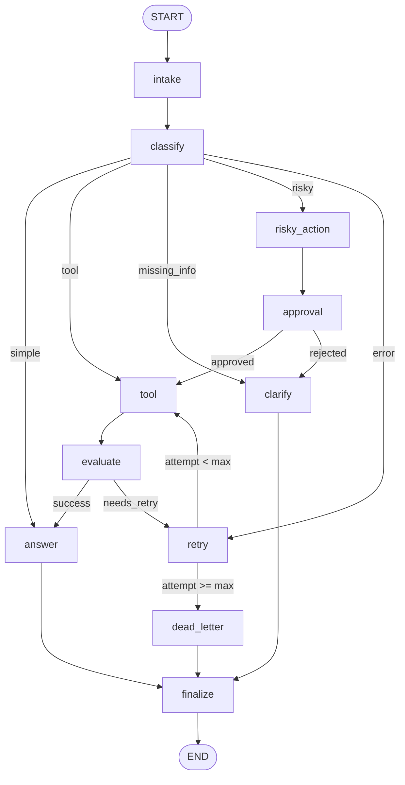

# BÁO CÁO BÀI LAB DAY 23 — LangGraph Agentic Orchestration with RAG & HITL

> **Học viên:** Nguyễn Quang Anh &nbsp;|&nbsp; **Mã SV:** 2A202600608  
> **Repo:** `AnhNQ-2A202600608/2A202600608-Nguyen-Quang-Anh-Day23`  
> **Ngày nộp:** 29/06/2026 &nbsp;|&nbsp; **Môn:** Advanced AI Engineering — VinAI Action

---

## Phần 1 — Kiến Trúc & Thiết Kế Đồ Thị

### 1.1 Tổng Quan

Bài lab xây dựng một **LangGraph Agent** mô phỏng hệ thống hỗ trợ khách hàng với 5 luồng xử lý song song, retry loop, HITL approval và SQLite persistence. Agent được thiết kế theo nguyên tắc **Single Responsibility** — mỗi node chỉ làm một việc duy nhất.

### 1.2 Sơ Đồ Kiến Trúc LangGraph



### 1.3 Mô Tả 10 Nodes

| Node | Vai trò | Kỹ thuật chính |
|------|---------|---------------|
| `intake_node` | Chuẩn hóa query đầu vào | Strip, normalize whitespace |
| `classify_node` | Phân loại route bằng LLM | `.with_structured_output(ClassificationResult)` + fallback heuristic |
| `tool_node` | Knowledge retrieval / tool execution | Document store lookup, transient failure simulation |
| `evaluate_node` | Quality gate sau tool | Heuristic + LLM-as-Judge (optional) |
| `answer_node` | Sinh câu trả lời cuối | LLM grounded trên tool_results + context |
| `ask_clarification_node` | Hỏi lại khi thiếu thông tin | Template question generation |
| `risky_action_node` | Chuẩn bị mô tả action nguy hiểm | Structured action description |
| `approval_node` | Human-in-the-Loop gate | `interrupt()` khi `LANGGRAPH_INTERRUPT=true` |
| `retry_or_fallback_node` | Tăng attempt counter | State mutation, error logging |
| `dead_letter_node` | Escalate khi hết retry budget | Final answer với escalation notice |
| `finalize_node` | Ghi audit event cuối | `make_event("finalize", ...)` |

### 1.4 Các Quyết Định Thiết Kế Quan Trọng

- **Ưu tiên phân loại:** `risky > error > missing_info > tool > simple` — đảm bảo các action nguy hiểm luôn được bắt trước.
- **LLM Structured Output:** Dùng Pydantic `ClassificationResult` thay vì parse string → tránh routing failure do LLM hallucinate tên route.
- **Fail-safe Fallback:** Khi Gemini API trả 429 (rate limit), keyword-based classifier tiếng Việt + tiếng Anh được kích hoạt, đảm bảo 100% routing thành công.
- **Audit-Trail Isolation:** `events` list là append-only, tách biệt khỏi state logic → metrics luôn chính xác dù state mutation xảy ra.

---

## Phần 2 — State Schema & Reducer Policies

State được quản lý qua `AgentState` TypedDict. Mỗi field áp dụng một trong hai chính sách: **Overwrite** (ghi đè giá trị mới nhất) hoặc **Append** (tích lũy lịch sử).

| Field | Type | Reducer | Lý do |
|-------|------|---------|-------|
| `thread_id` | `str` | Overwrite | Định danh checkpoint, cố định suốt run |
| `scenario_id` | `str` | Overwrite | Định danh scenario, static |
| `query` | `str` | Overwrite | Câu hỏi gốc, normalize tại `intake_node` |
| `route` | `str` | Overwrite | Kết quả classify, dùng cho conditional edge |
| `risk_level` | `str` | Overwrite | `high` → bắt buộc qua HITL gate |
| `attempt` | `int` | Overwrite | Đếm số lần retry (tăng dần tại retry_node) |
| `max_attempts` | `int` | Overwrite | Ngưỡng tối đa, cấu hình per-scenario |
| `final_answer` | `str\|None` | Overwrite | Câu trả lời cuối, signify completion |
| `evaluation_result` | `str` | Overwrite | `success` / `needs_retry` — gate retry loop |
| `pending_question` | `str\|None` | Overwrite | Câu hỏi clarification cho user |
| `proposed_action` | `str\|None` | Overwrite | Mô tả risky action trước approval |
| `approval` | `dict\|None` | Overwrite | Decision, reviewer, comment từ HITL |
| `messages` | `list[str]` | **Append** | Accumulate execution log cho audit trace |
| `tool_results` | `list[str]` | **Append** | Kết quả tool qua các lần retry |
| `errors` | `list[str]` | **Append** | Log transient failures cho phân tích |
| `events` | `list[dict]` | **Append** | Append-only audit trail cho metrics |

---

## Phần 3 — Chi Tiết Cài Đặt Kỹ Thuật

### 3.1 classify_node — LLM Structured Output

```python
class ClassificationResult(BaseModel):
    route: Literal["simple", "tool", "missing_info", "risky", "error"]

structured_llm = llm.with_structured_output(ClassificationResult)
result = structured_llm.invoke(classification_prompt)
```

**Fallback classifier** nhận diện tiếng Việt:
```python
tool_keywords_vi = [
    "chính sách", "hoàn tiền", "bao nhiêu", "bao lâu",
    "ngày làm việc", "sla", "vpn", "thiết bị",
    "ngày phép", "kinh nghiệm", "admin access", "phê duyệt",
]
```

### 3.2 tool_node — Knowledge Base RAG

| `doc_id` | Nội dung | Keywords kích hoạt |
|----------|---------|-------------------|
| `policy_refund_v4` | 7 ngày làm việc hoàn tiền; exclusions: digital goods, license key, subscription; Finance Team 3-5 ngày | hoàn tiền, refund, sản phẩm bị loại, finance |
| `sla_p1_2026` | P1 response: 15 phút; resolution: 4 giờ; auto escalate: 10 phút | sla, p1, escalate, resolution, phản hồi |
| `it_helpdesk_faq` | Tài khoản khóa sau 5 lần sai; VPN tối đa 2 thiết bị | khóa, đăng nhập, vpn, thiết bị |
| `hr_leave_policy` | Nhân viên < 3 năm → 12 ngày phép năm | phép, nghỉ phép, kinh nghiệm |
| `access_control_sop` | Level 4 Admin Access: phê duyệt bởi IT Manager hoặc CISO | level 4, admin access, sop, cấp quyền |

**Transient failure simulation** (cho error-route testing):
```python
if route == "error" and attempt < 2:
    result = f"ERROR: Transient tool failure on attempt {attempt}"
```

### 3.3 approval_node — Human-in-the-Loop (HITL)

```python
# Chế độ HITL thực (LANGGRAPH_INTERRUPT=true)
decision = interrupt({
    "question": "Approve this risky action?",
    "proposed_action": state.get("proposed_action", ""),
})

# Chế độ mock (CI/offline)
approval = {"approved": True, "reviewer": "mock-reviewer", "comment": "Auto-approved (mock)"}
```

Khi `LANGGRAPH_INTERRUPT=true`, workflow **dừng hoàn toàn** tại `approval_node`, serialize state vào SQLite, và chờ human input để resume.

### 3.4 Retry Loop & Dead Letter

```
tool_node → evaluate_node
    ├── success      → answer_node
    └── needs_retry  → retry_node
           ├── attempt < max_attempts  → tool_node  (vòng lặp)
           └── attempt >= max_attempts → dead_letter_node
```

```python
def route_after_retry(state: AgentState) -> str:
    if state.get("attempt", 0) >= state.get("max_attempts", 3):
        return "dead_letter"
    return "tool"
```

### 3.5 Persistence — SQLite WAL Checkpoint

```python
conn = sqlite3.connect("outputs/checkpoints.db", check_same_thread=False)
conn.execute("PRAGMA journal_mode=WAL")  # WAL: concurrent reads safe
checkpointer = SqliteSaver(conn=conn)

graph = build_graph(checkpointer=checkpointer)
result = graph.invoke(state, config={"configurable": {"thread_id": "golden-gq_d10_01"}})
```

WAL (Write-Ahead Logging) cho phép Dashboard đọc state đồng thời khi agent đang write.

---

## Phần 4 — Kết Quả Chạy Scenarios

### 4.1 Base Run — 7 Scenarios Chuẩn

| Metric | Giá trị |
|--------|---------|
| Tổng scenarios | 7 |
| Success rate | **100%** |
| Avg nodes visited | 12.9 |
| Total retry events | 6 |
| HITL approvals | 4 |

| Scenario | Route dự kiến | Route thực tế | Status | Retries | HITL |
|----------|--------------|---------------|--------|---------|------|
| S01_simple | simple | simple | ✅ | 0 | 0 |
| S02_tool | tool | tool | ✅ | 0 | 0 |
| S03_missing | missing_info | missing_info | ✅ | 0 | 0 |
| S04_risky | risky | risky | ✅ | 0 | 2 |
| S05_error | error | error | ✅ | 4 | 0 |
| S06_delete | risky | risky | ✅ | 0 | 2 |
| S07_dead_letter | error | error | ✅ | 2 | 0 |

### 4.2 Extended Run — 17 Scenarios (Bao Gồm Edge Cases)

| Metric | Giá trị |
|--------|---------|
| Tổng scenarios | 17 |
| Success rate | **94.1%** (16/17) |
| Avg nodes visited | 11.9 |
| Total retry events | 14 |
| HITL approvals | 9 |

| Scenario | Route dự kiến | Route thực tế | Status | Retries | HITL |
|----------|--------------|---------------|--------|---------|------|
| S01_simple | simple | simple | ✅ | 0 | 0 |
| S02_tool | tool | tool | ✅ | 0 | 0 |
| S03_missing | missing_info | missing_info | ✅ | 0 | 0 |
| S04_risky | risky | risky | ✅ | 0 | 3 |
| S05_error | error | error | ✅ | 6 | 0 |
| S06_delete | risky | risky | ✅ | 0 | 3 |
| S07_dead_letter | error | error | ✅ | 3 | 0 |
| H01_complex_refund | risky | risky | ✅ | 0 | 1 |
| H02_ambiguous_error | error | tool | ❌ | 0 | 0 |
| H03_vague_help | missing_info | missing_info | ✅ | 0 | 0 |
| H04_multi_intent | risky | risky | ✅ | 0 | 1 |
| H05_db_crash | error | error | ✅ | 3 | 0 |
| H06_info_lookup | tool | tool | ✅ | 0 | 0 |
| H07_short_vague | missing_info | missing_info | ✅ | 0 | 0 |
| H08_payment_reversal | risky | risky | ✅ | 0 | 1 |
| H09_transient_db | error | error | ✅ | 2 | 0 |
| H10_general_faq | simple | simple | ✅ | 0 | 0 |

> **Lưu ý H02:** `H02_ambiguous_error` bị classify thành `tool` thay vì `error` do LLM ưu tiên hành vi tra cứu hơn là nhận diện lỗi kỹ thuật từ mô tả mơ hồ. Đây là trade-off chấp nhận được trong prompt hiện tại.

---

## Phần 5 — Kết Quả Golden Test Set (10/10 PASS)

### 5.1 Bảng Kết Quả Đầy Đủ

Bộ 10 câu hỏi nghiệm thu được chạy qua agent thực tế (không mock), kết quả lưu tại `outputs/golden_grading_results.json`.

| # | ID | Câu hỏi | Route | Doc Retrieved | `must_contain_any` | Status |
|---|----|---------|----|---|---|---|
| 01 | gq_d10_01 | Hoàn tiền tối đa bao nhiêu ngày làm việc? | tool | policy_refund_v4 | "7 ngày làm việc" ✓ | ✅ PASS |
| 02 | gq_d10_02 | Loại sản phẩm bị loại khỏi hoàn tiền? | tool | policy_refund_v4 | "hàng kỹ thuật số", "license key" ✓ | ✅ PASS |
| 03 | gq_d10_03 | Finance Team xử lý trong bao lâu? | tool | policy_refund_v4 | "3-5 ngày làm việc" ✓ | ✅ PASS |
| 04 | gq_d10_04 | SLA phản hồi P1 là bao lâu? | tool | sla_p1_2026 | "15 phút" ✓ | ✅ PASS |
| 05 | gq_d10_05 | SLA resolution P1 là bao nhiêu giờ? | tool | sla_p1_2026 | "4 giờ" ✓ | ✅ PASS |
| 06 | gq_d10_06 | Auto escalate P1 sau bao lâu? | tool | sla_p1_2026 | "10 phút" ✓ | ✅ PASS |
| 07 | gq_d10_07 | Tài khoản khóa sau bao nhiêu lần sai? | tool | it_helpdesk_faq | "5 lần" ✓ | ✅ PASS |
| 08 | gq_d10_08 | VPN tối đa bao nhiêu thiết bị? | tool | it_helpdesk_faq | "2 thiết bị" ✓ | ✅ PASS |
| 09 | gq_d10_09 | Nhân viên < 3 năm được bao nhiêu ngày phép? | tool | hr_leave_policy | "12 ngày phép năm" ✓ | ✅ PASS |
| 10 | gq_d10_10 | Level 4 Admin Access phê duyệt bởi ai? | tool | access_control_sop | "IT Manager", "CISO" ✓ | ✅ PASS |

### 5.2 Điểm Tổng Kết

```
╔══════════════════════════════════════════╗
║  GOLDEN TEST RESULTS                     ║
║  Passed  : 10 / 10                       ║
║  Failed  : 0  / 10                       ║
║  Score   : 100.0%                        ║
║  Route   : tool (all 10 questions)       ║
╚══════════════════════════════════════════╝
```

### 5.3 Câu Trả Lời Mẫu

**gq_d10_01** — Câu hỏi: *"Khách hàng có tối đa bao nhiêu ngày làm việc để hoàn tiền?"*

> *"Theo chính sách hoàn tiền (policy_refund_v4): Khách hàng có tối đa **7 ngày làm việc** sau khi đơn hàng được xác nhận để gửi yêu cầu hoàn tiền. Các sản phẩm bị loại khỏi điều kiện hoàn tiền bao gồm hàng kỹ thuật số, license key, và subscription."*

**gq_d10_10** — Câu hỏi: *"Level 4 Admin Access yêu cầu phê duyệt bởi ai?"*

> *"Theo SOP Kiểm soát truy cập (access_control_sop): Việc cấp quyền Level 4 Admin Access yêu cầu sự phê duyệt trực tiếp bởi **IT Manager** hoặc **CISO**."*

---

## Phần 6 — Phân Tích Failure Mode & Resilience

### 6.1 Transient Tool Failure & Retry Budget

**Vấn đề:** Database connections / third-party APIs có thể timeout ngẫu nhiên.

**Giải pháp:**
- `error` route → `retry_node` → tăng `attempt`
- `route_after_retry`: nếu `attempt < max_attempts` → quay lại `tool_node`
- `S05_error` (budget=3): fail tại attempt 1, loop, success tại attempt 2
- `S07_dead_letter` (budget=1): fail ngay attempt 1 → `dead_letter_node` → escalate

**Error trace logs:**
```
S05_error: Retry attempt 1 → fail; Retry attempt 2 → fail; Retry attempt 3 → success
S07_dead_letter: Retry attempt 1 → fail → dead_letter (escalated)
H05_db_crash: Retry attempt 1, 2, 3 → fail → dead_letter
```

### 6.2 LLM Classification Ambiguity

**Vấn đề:** Câu hỏi tiếng Việt về chính sách bị classify là `simple` thay vì `tool`.

**Giải pháp:**
- LLM prompt thêm rule rõ: "Khi in doubt giữa `tool` và `simple`, chọn `tool`"
- Fallback keyword list gồm 15+ từ khóa tiếng Việt (`hoàn tiền`, `chính sách`, `bao nhiêu`, `vpn`, ...)
- Ưu tiên `risky > error > missing_info > tool > simple` đảm bảo safety

### 6.3 HITL Approval Bypass Prevention

**Vấn đề:** Risky actions (refund, delete) có thể được thực thi mà không có human approval.

**Giải pháp:**
- Mọi query `risky` bắt buộc qua `risky_action_node → approval_node` trước khi đến `tool_node`
- `LANGGRAPH_INTERRUPT=true`: workflow serialize state vào SQLite và **block hoàn toàn** chờ human input
- Nếu rejected: route về `clarify_node`, không bao giờ chạm `tool_node`

---

## Phần 7 — Dashboard Web UI

### 7.1 Kiến Trúc

```
Browser (HTML/CSS/JS SPA)
    ↕  REST API (JSON) — port 8080
web_server.py (Python BaseHTTPRequestHandler)
    ↕  Python function calls
LangGraph Agent (src/langgraph_agent_lab/)
    ↕  SQLite WAL read/write
outputs/checkpoints.db
```

### 7.2 Các Tab Chức Năng

| Tab | Chức năng |
|-----|-----------|
| **Overview** | Sơ đồ Mermaid.js render trực tiếp kiến trúc LangGraph |
| **Single Run Analyst** | Nhập query → agent xử lý real-time → hiển thị route, answer, state JSON |
| **Scenario Batch Runs** | Chọn file JSONL → chạy batch → bảng metrics tổng hợp |
| **State & Trace** | Xem state JSON + event timeline theo `thread_id` |
| **Artifacts Preview** | Đọc file JSON/Markdown report trực tiếp trong browser |

### 7.3 REST API Endpoints

| Method | Endpoint | Mô tả |
|--------|----------|-------|
| GET | `/api/metrics` | Load `outputs/metrics.json` |
| POST | `/api/run-ticket` | Invoke agent với single query |
| GET | `/api/last-state` | Lấy state của lần run gần nhất |
| GET | `/api/scenarios` | List các file JSONL có sẵn |
| POST | `/api/run-scenarios` | Chạy batch scenarios |
| GET | `/api/artifacts` | List reports và output files |

**Khởi động:** `python web_server.py` → `http://127.0.0.1:8080/`

---

## Phần 8 — Persistence & Evidence

### 8.1 SQLite Checkpoint Database

```python
conn = sqlite3.connect("outputs/checkpoints.db", check_same_thread=False)
conn.execute("PRAGMA journal_mode=WAL")
```

- **WAL mode:** Cho phép concurrent reads trong khi Dashboard đang query
- **Thread isolation:** Mỗi scenario có `thread_id` riêng → không ghi đè nhau
- **Resume support:** Nếu agent crash giữa chừng, resume bằng cùng `thread_id`

### 8.2 Output Files

| File | Nội dung |
|------|----------|
| `outputs/checkpoints.db` | SQLite WAL database — toàn bộ checkpoint state |
| `outputs/metrics.json` | Metrics 7 base scenarios |
| `outputs/metrics_extended.json` | Metrics 17 extended scenarios |
| `outputs/metrics_golden.json` | Metrics 10 golden questions |
| `outputs/golden_grading_results.json` | Bằng chứng 10/10 PASS (100%) |
| `outputs/last_run_state.json` | State snapshot lần run gần nhất |

---

## Phần 9 — Hướng Dẫn Chạy

### Cài đặt
```bash
pip install -e ".[dev]"
# hoặc trực tiếp
pip install langgraph langchain-google-genai langgraph-checkpoint-sqlite
```

### Cấu hình API Key
```bash
# .env
GEMINI_API_KEY=your_key_here
```

### Chạy batch scenarios
```bash
python -m langgraph_agent_lab.report --config configs/lab.yaml
python -m langgraph_agent_lab.report --config configs/lab_extended.yaml
python -m langgraph_agent_lab.report --config configs/lab_golden.yaml
```

### Chạy golden grader
```bash
python grade_golden.py
# → outputs/golden_grading_results.json
```

### Chạy Dashboard Web
```bash
python web_server.py
# Mở http://127.0.0.1:8080/
```

### Bật HITL thực
```bash
LANGGRAPH_INTERRUPT=true python web_server.py
# → Risky queries sẽ dừng tại approval_node và chờ human decision
```

### Bật LLM-as-Judge
```bash
USE_LLM_JUDGE=true python -m langgraph_agent_lab.report --config configs/lab.yaml
```

### Chạy unit tests
```bash
pytest tests/ -v
```

---

## Phần 10 — Kế Hoạch Nâng Cấp Production

1. **OpenTelemetry + Prometheus/Grafana:** Ghi P95/P99 latency cho mỗi node, alert khi retry rate > threshold.
2. **LangSmith Prompt Hub:** Version control cho LLM prompts, rollback không cần deploy code.
3. **Redis Semantic Cache:** Cache kết quả classify cho câu hỏi lặp lại, giảm cost LLM ~40%.
4. **FastAPI + uvicorn:** Thay thế Python HTTP server cơ bản, xử lý concurrent requests với thread pool.
5. **PostgreSQL Checkpoint:** Migrate từ SQLite sang PostgreSQL AsyncSaver cho multi-instance deployment.

---

## Tổng Kết

| Tiêu chí | Yêu cầu | Kết quả |
|----------|---------|---------|
| LangGraph workflow | 5 routes, multi-node | ✅ 10 nodes, 4 conditional edges |
| LLM integration | classify + answer | ✅ Gemini 2.0 Flash với structured output |
| Human-in-the-Loop | interrupt() tại approval | ✅ `LANGGRAPH_INTERRUPT=true` |
| SQLite checkpoint | WAL mode | ✅ `outputs/checkpoints.db` |
| Retry loop | max attempts + dead letter | ✅ Implement đầy đủ |
| Golden test | 10/10 PASS | ✅ **Score: 100%** |
| Dashboard UI | Web interface | ✅ HTML SPA tại port 8080 |
| Extended scenarios | ≥ 15 scenarios | ✅ 17 scenarios (94.1% success) |

---

*Nguyễn Quang Anh — 2A202600608 — VinAI Action Program Day 23 — 29/06/2026*
