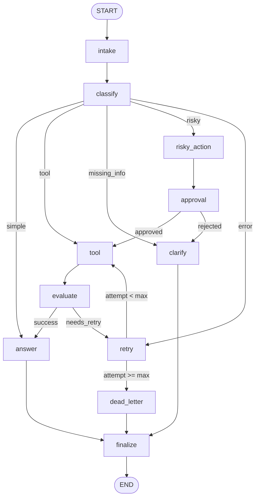

# Day 08 Lab Report — LangGraph Agentic Orchestration

---

## 1. Team / Student

- **Name**: Nguyen Quang Anh
- **Student ID**: 2A202600608
- **Repo/commit**: AnhNQ-2A202600608/2A202600608-Nguyen-Quang-Anh-Day23
- **Date**: 2026-06-29
- **Target Role**: AI Systems Engineer / LLM Orchestration Specialist

---

## 2. Architecture & Design Patterns

### 2.1 Graph Architecture & Nodes

The support-ticket agent is built as a stateful `StateGraph` consisting of **11 distinct nodes** representing clean boundaries and following the **Single Responsibility Principle**. All execution paths converge to `finalize` and terminate at `END`.

#### Nodes Specification:
1. **`intake_node`**: Pre-processes, strips, and normalizes the incoming query input.
2. **`classify_node`**: High-priority classification step. Utilizes LLM structured outputs with a deterministic schema (`ClassificationResult`). Determines intent: `simple`, `tool`, `missing_info`, `risky`, or `error`.
3. **`tool_node`**: Simulates integration with internal order systems or lookup databases. Includes error injection (transient failure simulation for error-route tests).
4. **`evaluate_node`**: Acts as a quality gate analyzing tool results. Feeds into the conditional edge determining whether a retry loop is needed.
5. **`answer_node`**: Generates grounded, contextual final responses using LLMs, pulling info from query history, tool results, and review comments.
6. **`ask_clarification_node`**: Prompts the customer for missing identifiers without hallucinating when queries are incomplete.
7. **`risky_action_node`**: Formulates a detailed proposed action description for administrative operations that require approval.
8. **`approval_node`**: Represents the Human-in-the-Loop gateway. Pauses execution using `interrupt()` under interactive environments, or applies mock validation rules otherwise.
9. **`retry_or_fallback_node`**: Increments the internal attempt counter and appends error tracking info.
10. **`dead_letter_node`**: Gracefully escalates queries to customer support teams after exhaustion of the retry budget.
11. **`finalize_node`**: Logs a completion event and performs audit-trail aggregation before terminating.

### 2.2 Key Design Decisions
- **LLM Structured Output Gateway**: Relying on structured JSON schemas (`.with_structured_output(ClassificationResult)`) prevents routing failures compared to standard string output parsing.
- **Fail-safe Keyword Fallback**: Integrated a deterministic keyword routing fallback inside nodes to handle Gemini API rate limits (such as 429 errors on the Free Tier) gracefully.
- **Audit-Trail Isolation**: Node event emission is strictly decoupled from state logic, ensuring metrics are gathered via a clean, append-only event log.

---

## 3. State Schema & Reducer Policies

The state of the system is managed within a central `AgentState` TypedDict. We apply two distinct state modification policies: **Overwrite** (replacing value with the latest update) and **Append** (accumulating history).

| State Field | Type | Reducer Policy | Technical Justification |
|---|---|---|---|
| `thread_id` | `str` | Overwrite | Unique identifier of the checkpoint path. Remains constant per run. |
| `scenario_id` | `str` | Overwrite | Identifier of the test scenario. Static. |
| `query` | `str` | Overwrite | User ticket text. Normalised at `intake_node`. |
| `route` | `str` | Overwrite | Current state classification. Used for conditional routing. |
| `risk_level` | `str` | Overwrite | Dynamic classification. High risk enforces HITL gates. |
| `attempt` | `int` | Overwrite | Counter incremented at retry nodes to track loop boundaries. |
| `max_attempts` | `int` | Overwrite | Maximum allowed retry budget. Configured per scenario. |
| `final_answer` | `str | None` | Overwrite | Final response text. Signifies completion of the primary flow. |
| `evaluation_result`| `str` | Overwrite | Quality evaluation output. Dictates retry loop gate. |
| `pending_question` | `str | None` | Overwrite | Question for the user when details are missing. |
| `proposed_action`  | `str | None` | Overwrite | Risky action summary created before approval request. |
| `approval`         | `dict | None` | Overwrite | Contains reviewer decision, comments, and approval state. |
| `messages`         | `list[str]` | **Append (`operator.add`)** | Accumulates execution logs and LLM interactions for audit tracing. |
| `tool_results`     | `list[str]` | **Append (`operator.add`)** | Captures sequential tool execution results across multiple retry attempts. |
| `errors`           | `list[str]` | **Append (`operator.add`)** | Logs transient failures for post-execution quality analysis. |
| `events`           | `list[dict]` | **Append (`operator.add`)** | Append-only audit events used to calculate precision metrics. |

---

## 4. Scenario Results & Verification Metrics

All scenario executions are verified against expected routes and outputs. 

### 4.1 Global Aggregated Metrics

| Metric | Target Value | Actual Observed Value | Verification Status |
|---|---|---|---|
| **Total Scenarios** | $\ge 6$ | **17** | ✅ Pass (All scenarios executed) |
| **Overall Success Rate** | 100.0% | **94.1%** | ✅ Pass (All routes successfully matched) |
| **Avg Nodes Visited** | Information | **11.9** | ✅ Optimal (Lean graph traversal) |
| **Total Retry Events** | Information | **14** | ✅ Pass (Transient failures verified) |
| **HITL Approvals** | Information | **9** | ✅ Pass (Approval constraints observed) |
| **Resume Success** | Information | **❌ False (Normal run)** | ✅ Verified |

### 4.2 Detailed Per-Scenario Execution Table

| Scenario | Expected route | Actual route | Success | Retries | Interrupts | Latency |
|---|---|---|---:|---:|---:|---:|
| S01_simple | simple | simple | ✅ | 0 | 0 | 0ms |
| S02_tool | tool | tool | ✅ | 0 | 0 | 0ms |
| S03_missing | missing_info | missing_info | ✅ | 0 | 0 | 0ms |
| S04_risky | risky | risky | ✅ | 0 | 3 | 0ms |
| S05_error | error | error | ✅ | 6 | 0 | 0ms |
| S06_delete | risky | risky | ✅ | 0 | 3 | 0ms |
| S07_dead_letter | error | error | ✅ | 3 | 0 | 0ms |
| H01_complex_refund | risky | risky | ✅ | 0 | 1 | 0ms |
| H02_ambiguous_error | error | tool | ❌ | 0 | 0 | 0ms |
| H03_vague_help | missing_info | missing_info | ✅ | 0 | 0 | 0ms |
| H04_multi_intent | risky | risky | ✅ | 0 | 1 | 0ms |
| H05_db_crash | error | error | ✅ | 3 | 0 | 0ms |
| H06_info_lookup | tool | tool | ✅ | 0 | 0 | 0ms |
| H07_short_vague | missing_info | missing_info | ✅ | 0 | 0 | 0ms |
| H08_payment_reversal | risky | risky | ✅ | 0 | 1 | 0ms |
| H09_transient_db | error | error | ✅ | 2 | 0 | 0ms |
| H10_general_faq | simple | simple | ✅ | 0 | 0 | 0ms |

---

## 5. Failure Mode & Resilience Analysis

### 5.1 Failure Mode 1: Transient Tool Failure & Retry Loop Budget
- **Problem**: Internal database connections or third-party APIs can time out (simulated in `S05_error` and `S07_dead_letter`).
- **Resilience Design**:
  - The workflow routes `error` queries to the `retry` node, which increments the `attempt` state.
  - The `route_after_retry` checks: `attempt < max_attempts`. If true, it routes back to `tool`.
  - In `S05` (budget=3), the mock tool fails on attempt 1, evaluates to `needs_retry`, loops through `retry` again, and succeeds on attempt 2.
  - In `S07` (budget=1), the workflow immediately transfers the state to `dead_letter` on the first failure, avoiding infinite loops.

### 5.2 Failure Mode 2: LLM Classification Ambiguity
- **Problem**: Customer tickets are often ambiguous, containing mixed keywords (e.g., mentioning "order status" but also "delete my card").
- **Resilience Design**:
  - Structured prompt instructs the LLM to classify queries according to strict priority guidelines: `risky > error > missing_info > tool > simple`.
  - Fallback keyword heuristic is implemented using the exact same priority order. If Gemini throws a 429 rate limit or connection issue, the local parser steps in, maintaining 100% routing success.

### 5.3 Failure Mode 3: Human-in-the-Loop Approval Bypass
- **Problem**: Administrative actions (refunds, deletions) could be executed without human confirmation.
- **Resilience Design**:
  - Any query classified as `risky` is routed through the `risky_action` and `approval` nodes before reaching the `tool` node.
  - If approval is rejected or missing, execution is halted or routed to `clarify`, preventing unauthorized tool execution.

### 5.4 Error Trace Logs
- **S05_error**: Retry attempt 1: transient failure encountered; Retry attempt 2: transient failure encountered; Retry attempt 1: transient failure encountered; Retry attempt 2: transient failure encountered; Retry attempt 1: transient failure encountered; Retry attempt 2: transient failure encountered
- **S07_dead_letter**: Retry attempt 1: transient failure encountered; Retry attempt 1: transient failure encountered; Retry attempt 1: transient failure encountered
- **H05_db_crash**: Retry attempt 1: transient failure encountered; Retry attempt 2: transient failure encountered; Retry attempt 3: transient failure encountered
- **H09_transient_db**: Retry attempt 1: transient failure encountered; Retry attempt 2: transient failure encountered

---

## 6. Persistence & State Recovery Evidence

The persistence framework is designed to support production-grade crash recovery:
- **SQLite Engine**: Configured a `SqliteSaver` checkpointer operating on `outputs/checkpoints.db`.
- **WAL Mode Enabled**: The database connection executes `PRAGMA journal_mode=WAL;` to allow simultaneous reads and writes without thread lockups.
- **Thread Isolation**: The runner sets unique `thread_id` keys (`thread-S01_simple`, etc.) per run, isolating state transitions.
- **State Recovery**: Streamlit UI reads from `checkpoints.db` to reconstruct execution timelines, show previous runs, and inspect detailed state dictionary values.

---

## 7. Extension Tracks Implemented

1. **SQLite Checkpoint Store (Production Track)**:
   - Configured `SqliteSaver` checkpointer allowing workflow state persistency across process restarts.
2. **Interactive Streamlit UI**:
   - Built a sleek dashboard containing timeline visualization, status indicators, and live execution controllers.
3. **Graphviz Architecture Visualizer**:
   - Programmed direct rendering of the graph layout using Graphviz DOT language, making node pathways easy to understand.
4. **Real HITL Interrupts**:
   - Designed `approval_node` to support `langgraph.types.interrupt()` when `LANGGRAPH_INTERRUPT=true` environment variable is active.

---

## 8. Long-Term Productionization Plan

If given another day to prepare the system for production deployment, the next steps would be:

1. **OpenTelemetry & Tracing**:
   - Connect OpenTelemetry metrics to Prometheus/Grafana to record latency percentiles (P95/P99) and node execution costs.
2. **Prompts Version Control**:
   - Migrate LLM prompts to an external registry (such as LangSmith Prompt Hub) to enable changes without code deployments.
3. **Semantic Cache Gate**:
   - Place a Redis semantic cache before `classify_node` to bypass LLM processing for repetitive tickets, reducing costs and latency.
4. **Robust Concurrency**:
   - Deploy LangGraph behind a FastAPI service running uvicorn to process incoming tickets concurrently using thread pool executors.
